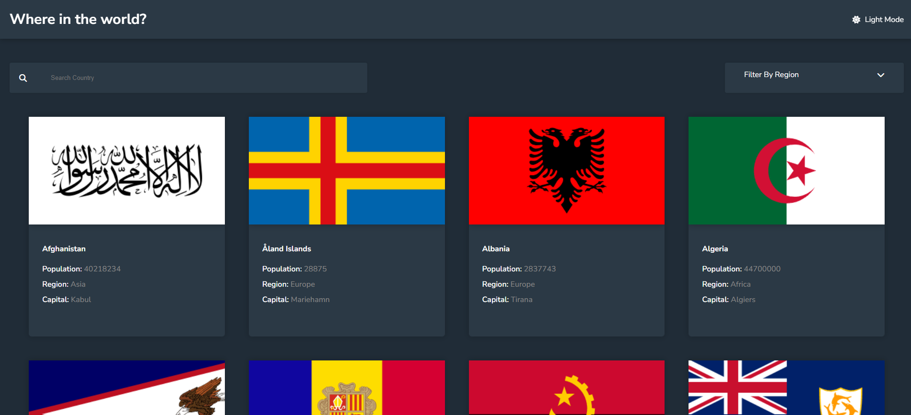

# Frontend Mentor - REST Countries API with Color Theme Switcher Solution

This is my solution to the [REST Countries API with Color Theme Switcher challenge](https://www.frontendmentor.io/challenges/rest-countries-api-with-color-theme-switcher-5cacc469fec04111f7b848ca) on Frontend Mentor. Frontend Mentor challenges are great for improving your coding skills by building realistic projects.

## Table of Contents
- [Overview](#overview)
  - [The Challenge](#the-challenge)
  - [Screenshot](#screenshot)
  - [Links](#links)
- [Built With](#built-with)
- [Author](#author)

## Overview

### The Challenge

Users should be able to:

- See all countries from the API on the homepage
- Search for a country using an `input` field
- Filter countries by region
- Click on a country to see more detailed information on a separate page
- Click through to the border countries on the detail page
- Toggle the color scheme between light and dark mode _(optional)_

### Screenshot

### Links

- Live Site URL: [Add live site URL here](https://country-info-smith.netlify.app/)

## Built With

- Semantic HTML5 markup
- CSS custom properties
- Flexbox
- CSS Grid
- Mobile-first workflow
- Vanilla JavaScript

## Author

**Soumyajoy Pal**

